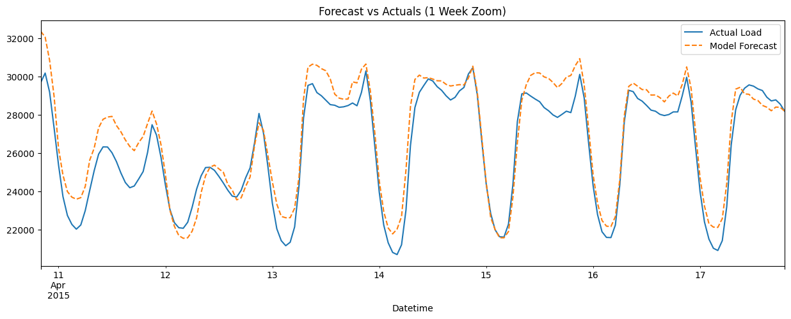

# Advanced Day-Ahead Energy Load Forecasting

## Overview

This project implements an **industry-standard machine learning pipeline** to forecast hourly energy consumption. It uses **XGBoost**, a **gradient boosting algorithm**, to predict future demand based on historical **PJM East** grid data. The focus is on creating a **production-ready framework** that includes rigorous **time-series cross-validation** and **financial impact analysis**.



## Business Context

In energy markets, utilities must forecast demand **24 hours ahead**.
* **Under-forecasting** requires buying power on the spot market (**Real-Time Market**), which can be **10x more expensive**.
* **Over-forecasting** results in **wasted generation capacity** or selling back at **negative prices**.

This model aims to minimize the **Mean Absolute Percentage Error (MAPE)** to reduce these financial risks.

## Dataset

* **Source:** **PJM Hourly Energy Consumption Data** (Kaggle)
* **Region:** **PJM East (PJME)**
* **Features:** Hourly energy demand (**MW**) from **2002 to 2018**.

## Methodology

### 1. Data Processing

* Handled **duplicate timestamps** caused by daylight savings transitions.
* Resampled data to a **strict hourly frequency** to ensure time-series continuity.
* Imputed minor missing data points using **forward-fill techniques** suitable for short gaps.

### 2. Feature Engineering

To capture the **cyclical nature** of energy demand, the following features were generated:
* **Temporal Features:** Hour of day, day of week, month, quarter, year.
* **Lag Features:** Load values from **24 hours**, **48 hours**, and **1 week (168 hours)** prior. This captures daily and weekly **autocorrelation**.
* **Rolling Statistics:** Rolling mean and standard deviation over **24-hour windows** to capture recent volatility.
* **Calendar Events:** Added **US Federal Holidays**, as demand patterns shift significantly on non-working days.

### 3. Modeling Strategy

* **Algorithm:** **XGBoost Regressor** (Gradient Boosting).
* **Validation:** **Time Series Walk-Forward Validation** (5 Folds). This strictly prevents **data leakage** by training only on **past data** and testing on **future data**.
* **Evaluation Metrics:** **Root Mean Square Error (RMSE)** and **Mean Absolute Percentage Error (MAPE)**.

## Results

* **Primary Driver:** The load from exactly **24 hours ago** (`lag_24`) was the **strongest predictor**, confirming the high autocorrelation in energy data.
* **Weekly Cycle:** The load from **one week ago** (`lag_168`) and the `DayOfWeek` feature were significant, enabling the model to distinguish between **weekday and weekend patterns**.
* **Error Distribution:** The model residuals are **normally distributed**, indicating the model has successfully captured the main trend and seasonality components.

## Financial Impact Calculation

A simplified risk analysis was conducted assuming:
* **Cost of Under-Forecasting** (Spot Market Premium): **$50/MWh**
* **Cost of Over-Forecasting** (Wasted Capacity): **$10/MWh**

This calculation translates the model's **RMSE** directly into potential **monthly financial exposure**.

## Files

* **`Advanced_Day_Ahead_Forecasting.ipynb`**: The complete Jupyter Notebook containing code, visualization, and analysis.
* **`PJME_hourly.csv`**: The raw dataset file.

## Dependencies

* **Python 3.x**
* **pandas**, **numpy**
* **matplotlib**, **seaborn**
* **xgboost**
* **shap**
* **scikit-learn**


To run the repository locally, you need to follow these steps:

1.  **Clone the Repository:**
    Open your terminal or command prompt and run:

    ```bash
    git clone https://github.com/ernselito/Advanced-Day-Ahead-Energy-Load-Forecasting.git
    cd Advanced-Day-Ahead-Energy-Load-Forecasting
    ```

2.  **Create a Virtual Environment (Recommended):**
    It's best practice to create a virtual environment to manage dependencies.

      * **Windows:**
        ```bash
        python -m venv venv
        venv\Scripts\activate
        ```
      * **macOS/Linux:**
        ```bash
        python3 -m venv venv
        source venv/bin/activate
        ```

3.  **Install Dependencies:**
    Install the required Python packages listed in `requirements.txt`:

    ```bash
    pip install -r requirements.txt
    ```

    *(Note: If you are on macOS, you might need to run `brew install libomp` first if you encounter errors installing XGBoost).*

4.  **Run the Main Script:**
    Execute the main pipeline script:

    ```bash
    python main.py
    ```

    This will download the data, process it, train the model, save the model artifact, and generate plots in the `figures/` directory.

5.  **Run the Notebook (Optional):**
    If you prefer to explore the code interactively, you can launch Jupyter Notebook:

    ```bash
    jupyter notebook
    ```

    Then open `Advanced_Day_Ahead_Forecasting.ipynb`.

### **Troubleshooting Common Issues**

  * **`ModuleNotFoundError: No module named 'src'`**: If you get this error when running `python main.py`, try running it as a module instead:

    ```bash
    python -m main
    ```

    This ensures Python treats the current directory as a package root.

  * **XGBoost Errors on Mac**: As mentioned, macOS users often need OpenMP support. If `pip install xgboost` fails or runs with errors, try:

    ```bash
    brew install libomp
    pip install xgboost
    ```
